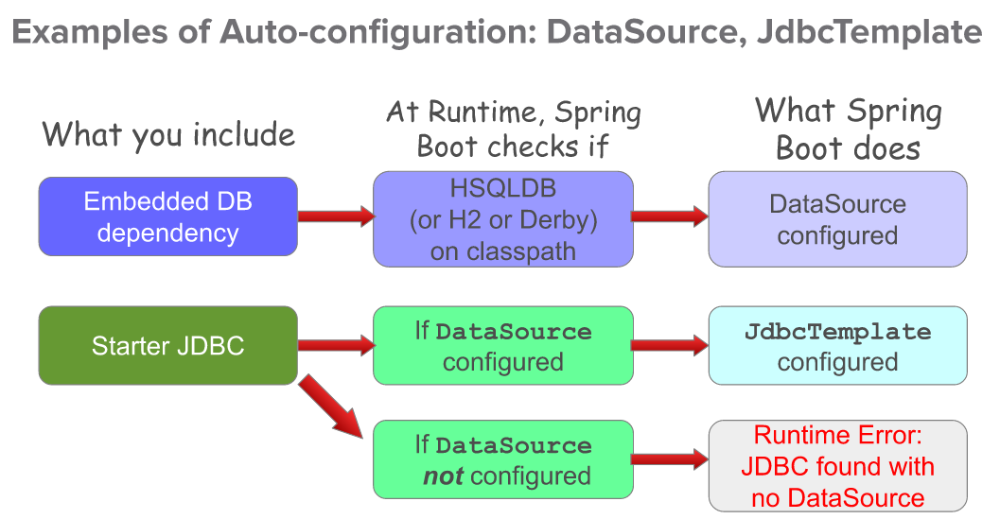
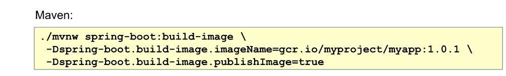
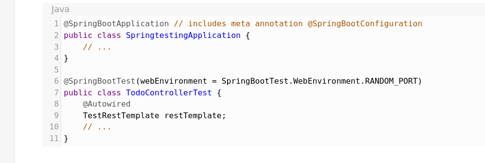

# 10- Spring Boot intro

Plan :
- what is spring boot
- features
        dependancy management, 
        auto-config,
        packaging and runtime, 
        integration testing, 

## 1. c'est quoi spring boot ?

Spring boot : prend une vue "opiniated" de spring et de librairies tierses
    => fait bcp de traitement sous-le capot pout
- offre un comportement par defaut
- offre aussi possibilité de changer ce comportement si necessaire

## 2. dependancy management

- probleme : dependances (ex:maven) de projet peut poser des problemes de divergence, jars incompatibles lors de passage de version etc 
- solution :
  - sprint boot parent / starters
  - ensemble de dependances versionnées comme package
  - si besoin de changer : 
    + exclude dependency
    + find correct version from starters (?) 

## 3. auto-config

@EnableAutoConfiguration :
- permet a spring de creer automatiquement des beans qu'il pense necessaire
- exemeple :
    - dependance tomcat-embeded.jar dispo => probablement le projet voudra  TomcatServletWebServerFactory disponible comme bean

tres commun : utiliser
+ @SpringBootConfiguration
+ @EnableAutoConfiguration
+ @ComponentScan
  ==> alias = *@SpringBootApplication(scanBasePackages="")*

auto-configuration - exemples :

## 4. packaging and runtime

- plugin interessant fournie par Spring Boot : spring-boot-maven-plugin
- plugin permet d'etendre le goal maven : 'package' => permet de packager en 2 jars :
    - .jar.original : contient uniquement mon code
    - fat .jar : contenant mon code + code des dependance, embedded tomcat etc... (jar bcp plus lourd !)
      - lancé avec : `java -jar mon-app.jar`
- ajoute aussi un nouveau goal : spring-boot:run => permet de lancer l'application

problematique : deployer notre application sur un env n'ayant pas de java (ex: sur le cloud...)
=> solution : docker
- spring-boot-maven-plugin fournie aussi goal : spring-boot:build-image

- utilise buildpacks.io pour la container-ization

## 5. integration testing

ITs sans spring boot :
- option 1 : @extendWith(SpringExtension.class) + @ContextConfiguration(basicConfig.class)
- option 2 (equivalent) : = @SpringJUnitConfig(basicConfig.class) 

(bonus : +@TestPropertySource(properties={"username=foo", "password=bar"}, locations="classpath:todo-test.properties"))

ITs avec spring boot :
- @SpringBootTest :
  - annotation très lourde car charge tout l'application contexte !
  - par defaut cherche la configuration @SpringBootConfiguration
  - charge tous les beans disponibles dans le Application Contexte

