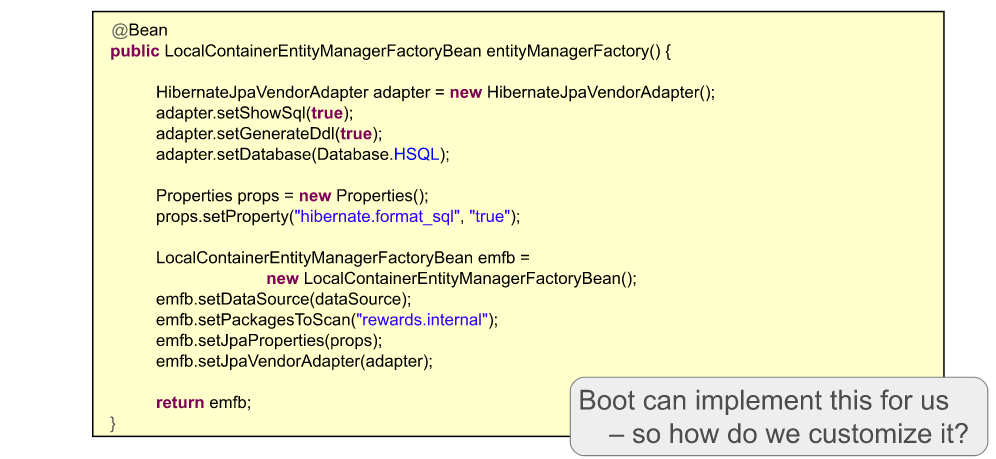
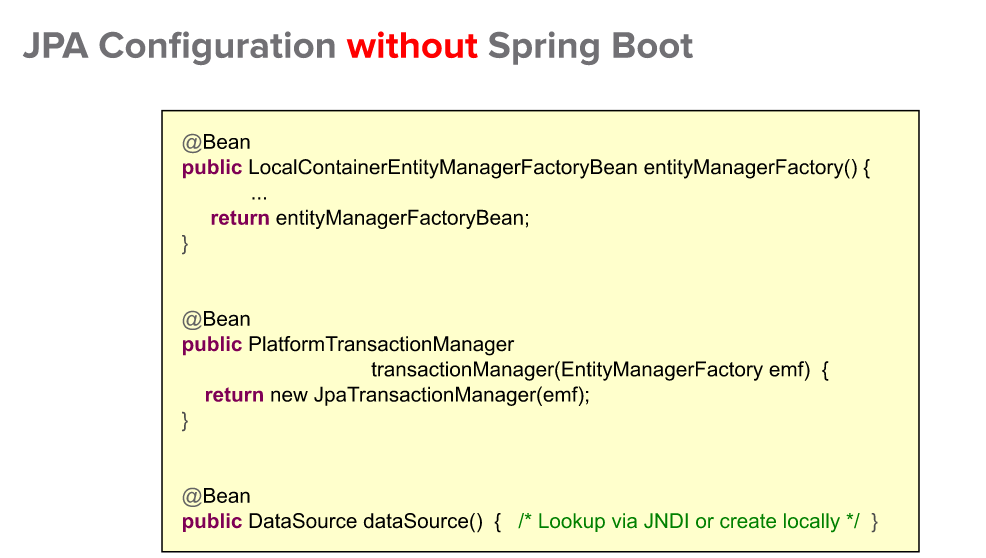
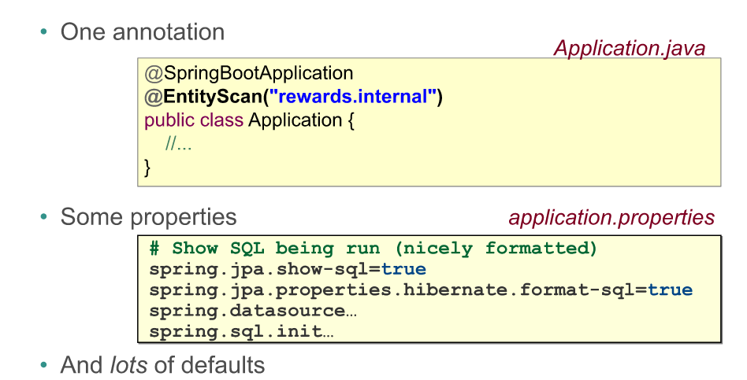
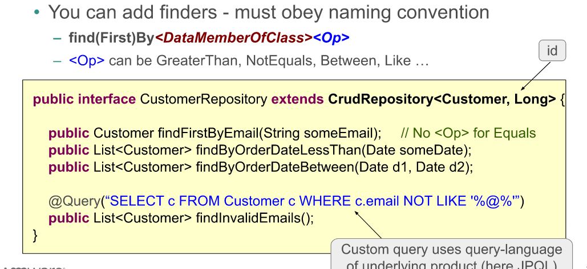

# 11- Spring Boot : a closer look

Plan :
- spring jpa with spring boot
- spring data - jpa

## 1. spring jpa with spring boot

si jpa est dans le classpath
    => spring automatiquement configure :
        - data source
- localContainerEntityManagerFactoryBean
- JpaTransactionManager

sans spring boot :

localContainerEntityManagerFactoryBean :
    class ayant une reference vers : 
        datasource
        vendorAdapter (hibernate...)
        type base de donnée  (hibernate...)
        jpa properties ...

entities :
- par defaut: spring cherche dans le meme package que la classe @EnableAutoConfiguration
- sinon : @entityScan ("org.nao.entities") (à mettre sur meme classe que @springBootApplication)

jpa configuration sans Spring boot :

jpa configuration avec Spring boot :

Spring data vs spring JPA ?

spring data :
- core project
- il a pr but de proposer les memes mecanisme de traitement pour les BDD relation que pr les NoSql
  - a travers une couche d'abstraction => template class
    - eviter la repetition de code
    - dataAccesExceptions
- repository faciles :
  1. annoter les classe de domain @entity, @id, @column... [annotations JPA, pr les bases SQL]
     - si NoSQL, aulieu de @entity: @document, @Region (gemfire), @NodeEntity (neo4j) [annotation spring data]

  2. annoter interface repository
    - etendre un Repository parmi la liste possible :
      - CrudRepository
      - PagingAndSortingRepository
      - ...
    - definir la signature des methodes 'finders' : findById, FindByFirstName...
    - definir @query assosié aux methodes, si requete avancé

  

- lors d'execution de l'application :
    - une classe proxy implement notre Repository
