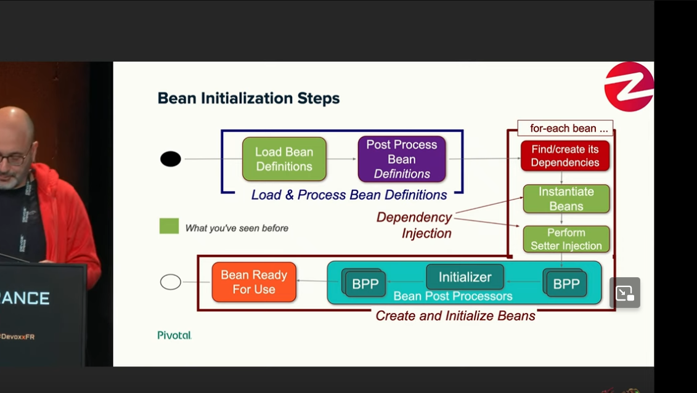

***
## questions:
  - expliquer comment sont gérés les Beans dans Spring,
    les principales phases, 
    et les interfaces qui rentrent en jeu

  - expliquer plus particulierement le role de BeanFactoryPostProcessor, et BeanPostProcessor
****

Les beans dans spring connaissant 2 phases majeurs:
- chargement
- creation
****
## 1. phase de chargement

  le bean est scanné et chargé par le container (ApplicationContext)
  ensuite, un postprocessing est possible sur les definitions des beans chargés
  
  l'interface BeanFactoryPostProcessor permet de connaitre les definitions d'une BeanFactory, 
  et changer ce definitions.
  BeanFactoryPostProcessor{ postProcessBeanFactory(factory) }
    
    
## 2. phase de creation

dans cette phase, le bean est d'abord instancié, et ensuite initialisé.

### creation > instantiation
en premier, les dependances du bean sont créé, et leur injections effectuée (contructeur..setter..).

### creation > initialisation

dans cette phase, les operations d'avant et apres initialisation sont appelés.

l'interface BeanPostProcessor permet d'ajouter un controle sur ces phase
      BeanPostProcessor{postProcessBeforeInitialization postProcessAfterInitialization}

fun facts:
  ApplicationContext est une implem de BeanFactory
########
##  annexe:

[youtube] Les secrets internes de Spring (Carl Azoury)
