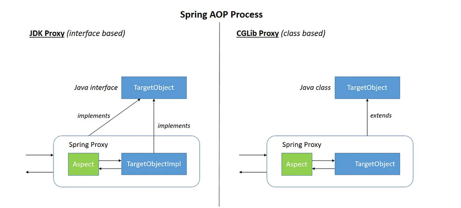

concepts clés :
    - aspect
    - advice
    - joinpoint
    - pointcut
    - Proxy

/*******************************************/
jointpoint :
    ::>
    - appel de methode, execution de methode, appel de constructeur, execution de constructeur,
     reference aux attributs, exception handling...

    ref@aspectj :
        dans un programme java, les methodes et constructeurs sont composé d'une entete et d'un corps.
        lorsque la methode est appelé, le corps de la methode est executée.

    - represente les evenements de l'execution du programme
    - ces evenement sont des CANDIDATS qu'il est POSSIBLE d'augmenter par L'AOP,

pointcut:
advice :

la declaration d'un advice/point cut dans spring aop repond  à trois questions :
- when : quand le code sera execute
    ::> @Before, @Around...
- where : quel join points cibles
    execution(* mon.package.MonService.hello(..))
- what : traitement, code a executer

**********************************

proxy mechanisms in spring :

2 facons :
- jdk dynamique (prefere)
- cglib

CGLib necessite plus de consideration :
- les methodes ne doivent pas être final
- ajouter des dependances CGlib
- le constructeurs de la classe Advised est appelée 2 fois
**********************************
class based proxy, interface based proxy :
***
class based proxy :
***
interface based proxy :

***********************************
