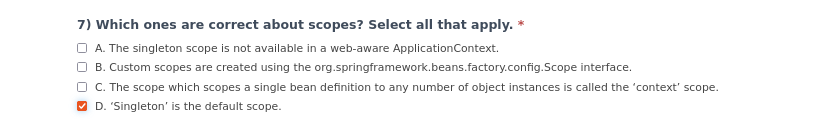
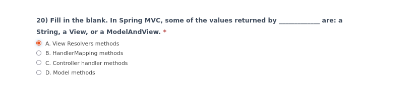

spring_data:

#transactional #isolation

#transactional #isolation

#transactional @aop

/*******************************/
/*******************************/
spring core:

#scope #singleton

/*******************************/
/*******************************/
spring testing:

#spring_boot #configuration #boot_testing
/********************************/
/********************************/
spring mvc:

#mvc #view_resolver
/********************************/
/********************************/
spring actuator :

#actuator_indicator #observability

/********************************/
/********************************/
/********************************/
/********************************/
