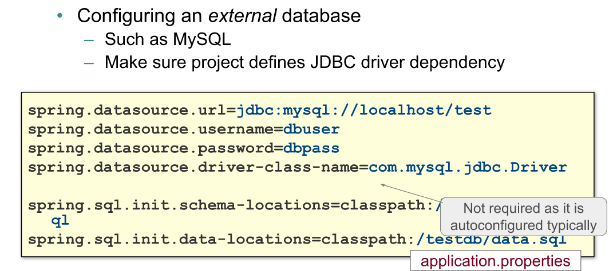
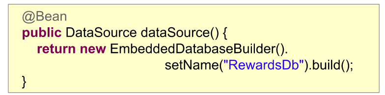

# 11- Spring Boot : a closer look

Plan :
1. properties,
2. @configurationProperties,
3. auto-configuration,
4. running an application,
5. optionnal : 
   - fine-tuning logging
   - fully executable jars, 

## 1. Properties ?

- spring boot detecte automatiquement les fichiers application.properties
  - => alimentent Environnement et les @Value

- location cherchés, dans l'ordre :
  - ./config/ du repertoire courant
  - repertoire courant
  - package "config" dans le classpath
  - classpath root
- Crée un PropertySource basé sur les fichiers .properties 

- spécifier le profile :
  - application-local.properties => properties dispo pour le profil 'local'
  - application-cloud.properties => properties dispo pour le profil 'cloud'

- supporte yml format
- dans 1 fichier yml, on peut inclure * fichiers 'logiques', séparé par "---"
  - =>pratique pr separer les profiles 

- precedence order : 

## 2. @ConfigurationProperties

- probleme : lors d'utilisation de @Value, très commun de repeter les prefixe :

`
@value("${local.db.url}") string url;
@value("${local.db.port}") string port;
@value("${local.db.....}") ...
`
+ solution :

`
@ConfigurationProperties(prefix="local.db")
class BasicConfig {
    string url;
    string port;
    ...
}
`
- pour activer :
  - @EnableConfigurationProperties + @ConfigurationPropertiesScan
    sur l'application (@SpringBootApplication class typiquement)
  - @ConfigurationProperties + @Component sur la class utilisant les properties

- detection de property : relaxed binding

## 3. Auto-configuration

comment l'auto-configuation est activée ?

annotations importantes :
- @Conditional (variantes : @ConditionnalOnClass, @ConditionnalOnMissingClass...)
  - @Profile est un exemple de @Conditional
  - permet la creation de bean uniquement si une condition est respectée :
    - ex : créer JdbcTemplate uniquement si bean DataSource est créé

## 4. overriding configuration

option pour controler la configuration utilisée :
1. set spring boot properties (ex: application.properties)
   

2. definir nos Bean afin d'empecher Spring de "deviner" :
   

3. exclure certaines configuration de l'auto-conf :
   - @EnableAutoConfiguration(exclude=...)
   - dans app.properties : spring.autoconfigure.exclude = ...
   

## 5. CommandLineRunner et ApplicationRunner

CommandLxineRunner : des beans speciaux, detecté par spring et appelé
    automatiquement avant de sortir de SpringApplication.run, et après que les autres beans soient configurés

bonus : 
lors de packaging de l'application (maven, spring-boot-plugin)
    on peut créer un jar executable ! (=sans java -jar)

(?) : c'est quoi le classPath ?
