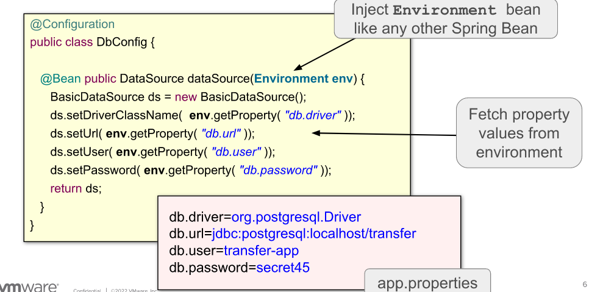
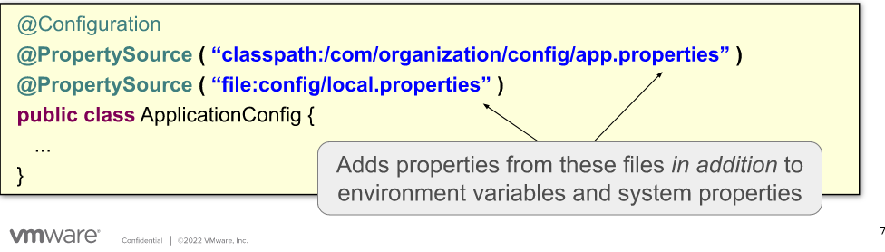
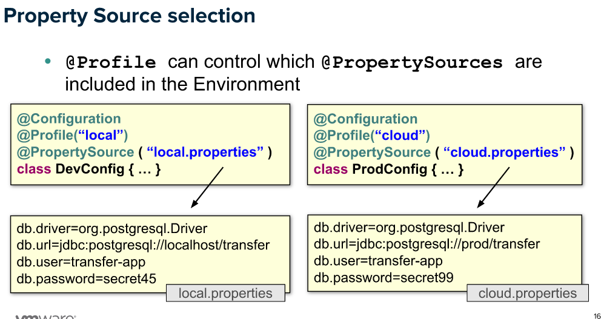
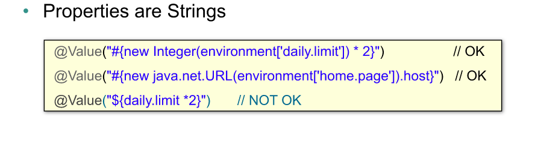
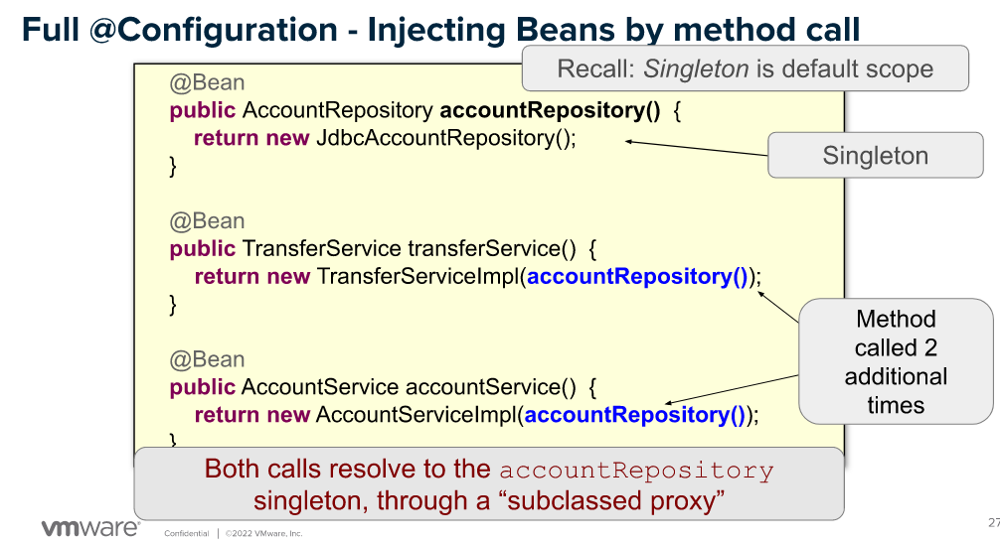

# 3- More Java Configuration

	External properties & Property sources
	Environment abstraction
	Using bean profiles
	Spring Expression Language (SpEL)

    Inter-Bean dependencies
	
***

Spring propose une Interface  : Environement 
    qui lit les properties decrites dans :

        - variables d'env : System.getenv() (contenu de PATH, PWD, java_home...)
        - properties de system : System.properties() (qui est connecté, version de java...)
        - properties java : dev.properties
    

***
	
- Environnement est alimentée depuis des "property sources"

- properties du System sont automatiquement injectés
- prefixes possibles : classpath, file, http

on peut aussi injecter la valeur d'une property variable avec @value :
    `@Bean public DataSource ds(@Value("${db.driver}") String driver) {...}`

***
## profiles :
  - possible utilisations :

      - au niveau de la classse
      - au niveau du bean
      - comment ça se lit ?
        - @profile("dev") : inclure Bean si profile dev est actif
        - @profile("!dev") : inclure Bean si profile  dev non actif  

  - activer profile :
    - property system - commandLine : -Dspring.profiles.active=dev,cloud
    - programmatically :
      - System.setProperty("spring.profiles.active", "dev,cloud")

  - @Profile + @PropertySource = trop génial :
  

***
## Spring Expression Language (SpEL)

- examples :
  - @value("$(db.url)")
  - equivalent à : @value("#(environnement['db.url'])")
  - 
- features :
  - default value : @value("$(db.rows.limit): 1000")
  - equivalent à
    - ternaire/elvis (?:) : @value("$(db.rows.limit) ?: 1000")

  - ***
## Inter-Bean dependencies

2 declarations possible de configurations :
- full : @Configuration 
  - => crée une sous-classe (XXXEnhancer) à la classe de conf. ce qui permet la resolution correcte des scopes typiquement
- lite : @Component ou bien  @Configuration(proxyBeanMethods = false)
  - => empeche la creation d'une sous-classe

##
