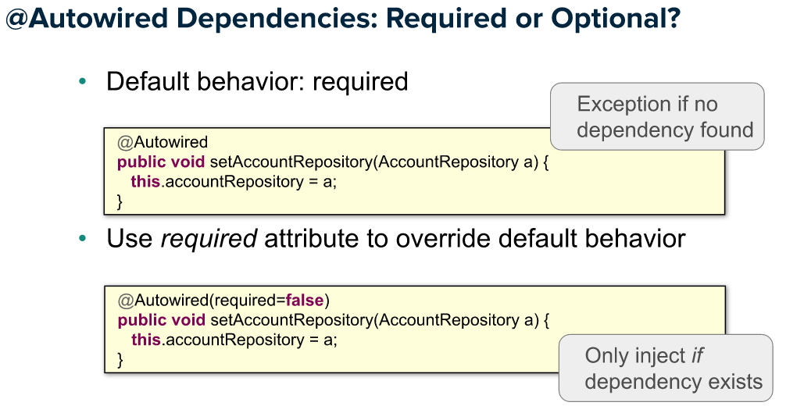
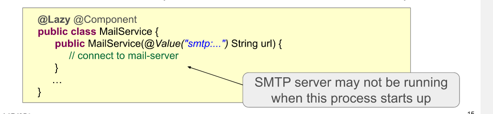

# 4- Annotation + Component Scanning

Plan :
- Component scanning
- Autowiring using @Autowired
- Java configuration versus annotations, mixing.
- Lifecycle annotations: @PostConstruct and @PreDestroy
- Stereotypes and meta-annotations

***
## 1. Component Scanning

declaration de bean :
- explicite : @bean dans classe @configuration
- implicite : declarer le bean a injecter @Component
  - (obligatoire ?:) si le @component declarer a des dependance, il doit etre dans le scope de 
    - @componentScan de la @configuration si on veut les injecter automatiquement

- Component Scanning
    - Spring scans also jar dependencies !
    - use @ComponentScan("org.package1", "org.package2") avec le package le plus précis possible, important pr la performance !

  - 
***
## 2. Autowiring using @Autowired

- Autowired
    - sur le constructeur [recommandé]. Optionnel si on a 1 seul constructeur (?)
    - sur setter
    - sur le field (mauvaise pratique, car dur à tester !)
- Si ambiguité de @components => @Component("CoolRepository") + @Qualifier("CoolRepository")
- priorité si ambiguité de @beans dispo : 
  1. DI par type
  2. par nom 

- par defaut, Spring cherche un @component avec le meme id/qualifier que le nom de variable à instancier.
    - @Autowired private Queue ack => spring cherche le @component("ack") correpondant au type Queue

- @Value : meme regles que @autowired : peut etre sur constructeur, setter ou field.
    - difference : @value à coté de la variable a alimenter, non sur la methode.

    - 
- methode @Autowired => methode appelé obligatoirement lors de la construction de bean
- si on souhaite l'appeler UNIQUEMENT si dependant existe => @Autowired(required=false)
  

- Bean initialisation
    - default : beans created on startup = when ApplicationContext (AC) created
    - can be lazy : @Lazy + @Component
        - created when dependency injected
        - ou bien quand AC.getBean("lazyB") appelé  
          

## 3. Java configuration versus annotations, mixing.

## 4. Lifecycle annotations: @PostConstruct and @PreDestroy

bean lifecycle :
contructor injection -> setter injections -> @postConstruct

- @preDestroy executé uniquement si application s'arrete normalement
    - => pas si process crash, ou est tué
    - pas executé sur les @prototypes (?)
    - 
- on peut aussi : @Bean(initMethod="setUp", destroyMethod="tearDown")
  - equivalent à @predestroy + @postconstruct
  - => recommandé pour les classes qu'on ne peut/veut pas modifier

## 5. Stereotypes and meta-annotations

Components stereotypes :
- service
- controller
- restController
- repository
- configuration
- ...

## (?) Questionnement (?) :
    - @autowired on setter can cause circular dependencies. Not constructor ?? 
- @predestroy pas executé sur les @prototypes (?)
- jvm shutdown hooks (??)
- default scanning strategy ? scan all projetct ? scan module ? 
